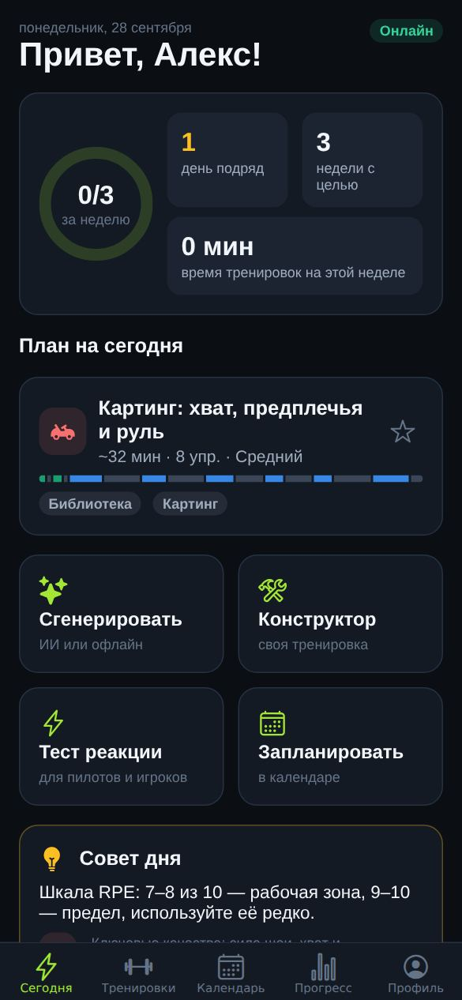
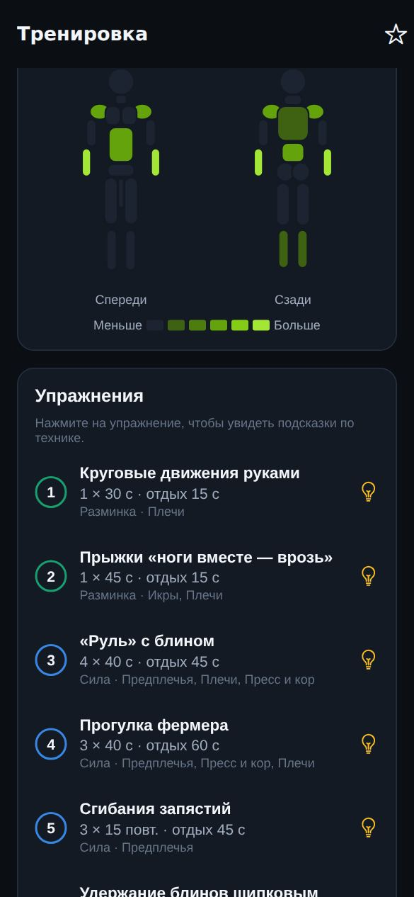
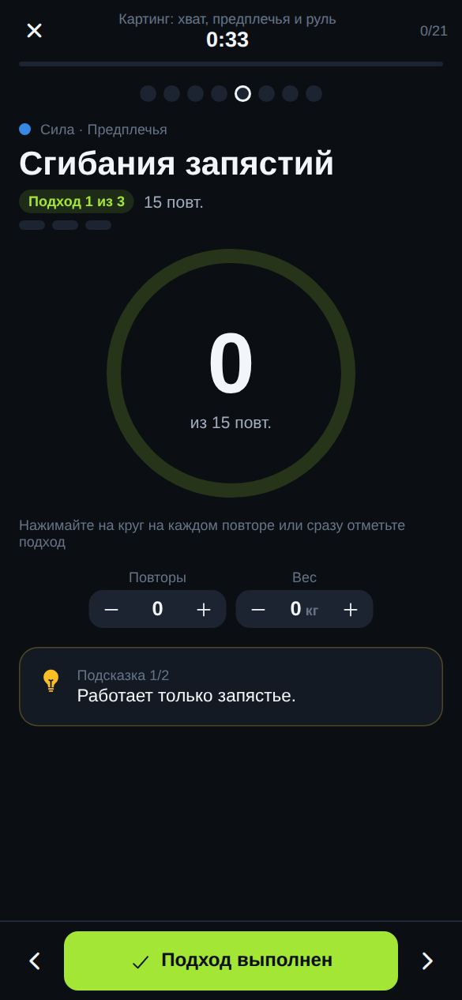
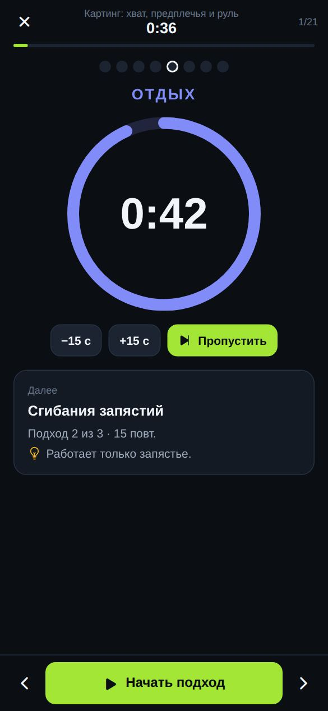
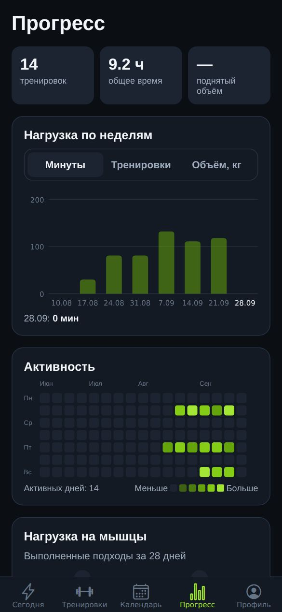
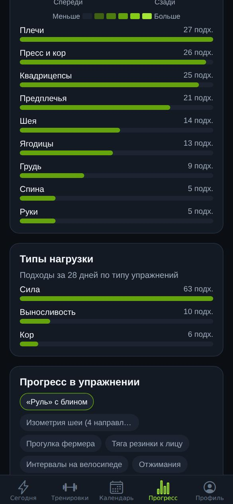
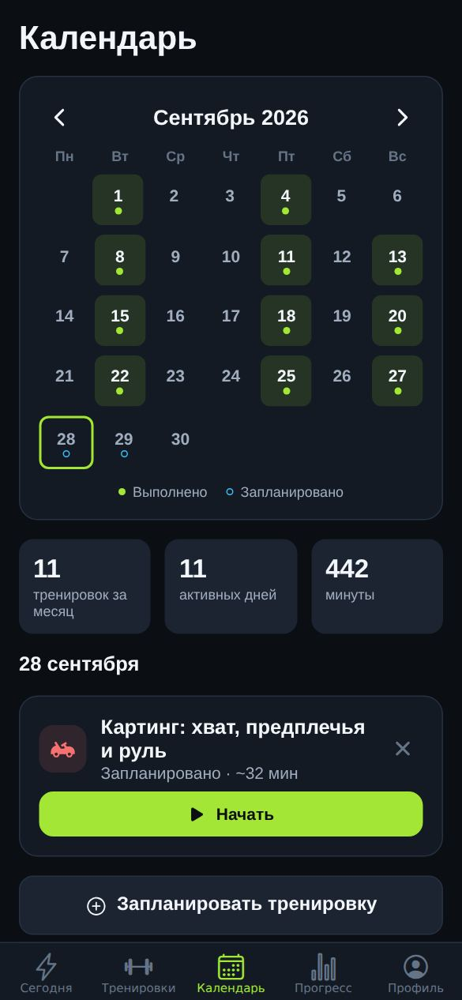
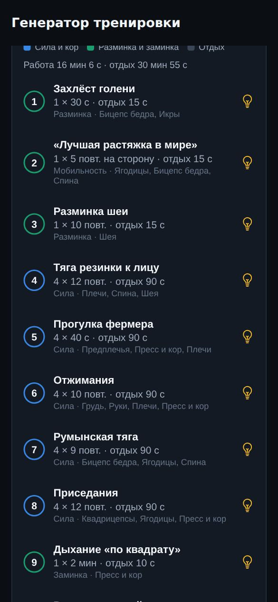

# Athlete Coach — тренировки для спортсменов

Приложение для **Android, iOS и браузера** (Expo / React Native), в котором спортсмен составляет, выполняет и отслеживает тренировки. Приложение рассчитано на футболистов, картингистов, бегунов, хоккеистов, баскетболистов, теннисистов, единоборцев, пловцов и велосипедистов, а также на общую физподготовку (ОФП).

**[Скачать APK для Android](https://github.com/alexsan4o/Traning-App/releases/latest/download/athlete-coach.apk)** · **[Открыть веб-версию](https://alexsan4o.github.io/Traning-App/)**

Работает **полностью офлайн**. Когда есть интернет, дополнительно доступны ИИ-тренер, онлайн-каталог тренировок и открытая база упражнений.

| Сегодня | Структура тренировки | Выполнение | Таймер отдыха |
|---|---|---|---|
|  |  |  |  |

| Прогресс | Карта мышц | Календарь | Генератор |
|---|---|---|---|
|  |  |  |  |

## Возможности

### Откуда берутся тренировки
- **Встроенная библиотека (офлайн).** 128 упражнений с описанием, подсказками по технике и частыми ошибками. К ним прилагаются 51 готовая программа для 12 направлений. Для картинга это шея, хват и «руль», кор и реакция; для футбола — скорость, профилактика травм (в духе FIFA 11+) и игровая выносливость.
- **Классические фитнес-программы.** Набор массы (фулбоди, сплит верх/низ, «тяни-толкай-ноги», дома с гантелями), похудение (круговая, ВИИТ, гантели, кардио), рельеф и тонус, ягодицы и ноги, сила 5×5, пресс, утренняя зарядка, растяжка. Быстрый вход — блок «Классические программы» на главном экране, в библиотеке есть фильтры по цели и уровню.
- **Тяжёлая атлетика (классическая «качалка»).** Программа новичка на базе (дни А и Б), сплит по группам мышц: грудь + трицепс, спина + бицепс, день ног, плечи + трапеции, день рук. Для профи — тяжёлые дни жима, приседа и становой и взрывная сила с элементами тяжёлой атлетики (взятие на грудь, жимовой швунг).
- **Уровни «Базовый», «Продвинутый», «Профи» по тренировочному стажу.** Стаж до 1 года — «Базовый», 1–3 года — «Продвинутый», больше 3 лет — «Профи». Стаж указывается при первом запуске и в профиле, уровень можно поправить вручную. Любую программу можно адаптировать под свой уровень: меняются подходы, повторы, время работы и отдых, разминка и заминка остаются прежними.
- **Замена упражнения на похожее.** Кнопка ⇄ у упражнения подбирает замену по тем же мышцам, типу нагрузки и фазе тренировки. Учитывается ваше оборудование. Замена работает в своей тренировке, в конструкторе и прямо во время тренировки (тогда она действует только в этот раз). Если заменить упражнение в программе из библиотеки, сохраняется ваша копия в «Мои».
- **ИИ-генерация (Claude, онлайн).** Спортсмен указывает вид спорта, цель, уровень, время, оборудование, акцентные мышцы и свободные пожелания («гонка в субботу, болит колено»). Модель составляет тренировку и учитывает последние тренировки. Ответ приходит в строгом формате JSON-схемы и сопоставляется с библиотекой упражнений.
- **Офлайн-генератор.** Работает без сети и API-ключа. Собирает тренировку из разминки, основной части и заминки: подбирает упражнения под доступное оборудование и ключевые для спорта мышцы, дозирует нагрузку по уровню и укладывает тренировку в заданное время.
- **Онлайн-каталог.** Готовые программы в формате JSON по URL: по умолчанию [`catalog/workouts.json`](catalog/workouts.json) из этого репозитория, адрес можно сменить в профиле. После загрузки каталог доступен офлайн.
- **База упражнений [wger.de](https://wger.de).** Поиск упражнений из открытой базы в конструкторе тренировки.
- **Конструктор и импорт.** Можно собрать свою тренировку, отредактировать копию готовой, поделиться тренировкой текстом (JSON) или импортировать её.

### Во время тренировки
- **Счётчик повторений.** Касание большого круга добавляет повтор. Если сразу нажать «Подход выполнен», засчитывается план.
- **Счётчик подходов и прогресс** по всей тренировке. Для каждого подхода записывается вес: подставляется значение из прошлой тренировки.
- **Таймер отдыха между подходами**: кольцевой индикатор, кнопки ±15 с и «Пропустить», вибрация и голосовой отсчёт. Если приложение свёрнуто, по окончании отдыха приходит **уведомление**.
- **Таймер для упражнений на время.** Для упражнений на каждую сторону голос подсказывает смену стороны.
- **Подсказки по технике**: они меняются во время подхода, а в отдыхе показывается совет к следующему упражнению.
- Экран не гаснет. Незавершённую тренировку можно продолжить после перезапуска приложения.

### Анализ и планирование
- **Календарь активности**: выполненные и запланированные тренировки, итоги месяца, планирование с повтором на 4 недели.
- **Визуализация**: структура тренировки на шкале «работа/отдых», карта нагрузки на мышцы (спереди и сзади), нагрузка по неделям (минуты, тренировки или объём), тепловая карта активности, прогресс в упражнении, рекорды.
- **Итоги тренировки**: оценка тяжести (RPE 1–10), заметки, новые личные рекорды.
- **Тест реакции** в двух режимах: «старт гонки» с пятью огнями и «смена цвета».
- **Цель на неделю**, серии дней и недель, совет дня по виду спорта.

## Установка на Android

Готовый APK собирается автоматически при каждом изменении ветки `main`:

**[Скачать последнюю версию (APK)](https://github.com/alexsan4o/Traning-App/releases/latest/download/athlete-coach.apk)** · [все сборки](https://github.com/alexsan4o/Traning-App/releases)

1. Откройте ссылку на телефоне и скачайте `athlete-coach.apk`.
2. Откройте файл. Android попросит разрешить установку из этого источника (браузера или «Файлов») — разрешите.
3. Новые версии ставятся поверх старой, данные сохраняются.

Сборку выполняет workflow [`android-apk.yml`](.github/workflows/android-apk.yml) (`expo prebuild` + Gradle, без аккаунтов и секретов). Её можно запустить и вручную: Actions → Android APK → Run workflow.

На iPhone отдельное приложение без платного аккаунта Apple Developer установить нельзя — используйте Expo Go (см. ниже) или сборку через EAS.

## Веб-версия

**[Открыть в браузере](https://alexsan4o.github.io/Traning-App/)** — работает на iPhone, Android и компьютере.

- **iPhone:** откройте ссылку в Safari → «Поделиться» → «На экран „Домой“». Приложение появится на экране с иконкой и будет открываться на весь экран, как обычное.
- **Android:** Chrome → меню ⋮ → «Установить приложение» (или «Добавить на главный экран»).
- После первого открытия работает без интернета (service worker кэширует приложение).
- Отличия от мобильной версии: нет уведомления об окончании отдыха, если браузер свёрнут, и нет вибрации на iPhone. Данные и API-ключ ИИ хранятся в этом браузере — для переноса используйте резервную копию в профиле.

Сайт публикуется на GitHub Pages автоматически при каждом изменении `main` (workflow [`web.yml`](.github/workflows/web.yml)). Локальная сборка: `WEB_BASE_URL=/Traning-App npx expo export --platform web && node scripts/finalize-web.mjs dist`.

## Запуск для разработки

Нужен Node.js 20+.

```bash
npm install
npx expo start
```

Отсканируйте QR-код приложением **Expo Go** на Android или iOS. Все используемые модули входят в Expo Go, отдельная сборка для разработки не нужна. Команда `npx expo start --web` запускает веб-версию локально.

### Сборка через EAS (Android и iOS)

Альтернатива встроенной сборке APK — облачный [EAS Build](https://docs.expo.dev/build/introduction/) (нужен аккаунт expo.dev):

```bash
npx eas-cli@latest build --platform android --profile preview   # APK для установки
npx eas-cli@latest build --platform ios --profile production    # сборка для App Store / TestFlight
```

## ИИ-тренер (Claude)

1. Получите API-ключ на [console.anthropic.com](https://console.anthropic.com) → API Keys.
2. В приложении откройте **Профиль → ИИ-тренер (Claude)** и сохраните ключ. Он хранится в защищённом хранилище устройства (Keychain / Keystore).
3. Генерация использует модель `claude-opus-5` через официальный SDK `@anthropic-ai/sdk`. Ответ приходит в строгом формате JSON-схемы (structured outputs), а при отказе модели срабатывает серверный резервный вариант (`fallbacks: "default"`).

Если ключа или сети нет, приложение незаметно переключается на офлайн-генератор.

> Ключ пользователя хранится на устройстве. Если вы распространяете приложение с собственным ключом, выносите запросы к Claude на свой сервер-прокси и не встраивайте ключ в сборку.

## Формат онлайн-каталога

```json
{
  "version": 1,
  "workouts": [
    {
      "id": "karting-race-day",
      "title": "Картинг: активация в день гонки",
      "sport": "karting",
      "goal": "mobility",
      "level": "beginner",
      "description": "…",
      "tips": ["…"],
      "exercises": [
        { "exerciseId": "neck-warmup", "sets": 1, "reps": 10, "restSec": 10 },
        { "exerciseId": "plank", "sets": 3, "durationSec": 45, "restSec": 30 },
        { "name": "Своё упражнение", "kind": "time", "category": "core", "muscles": ["core"], "sets": 2, "durationSec": 60, "restSec": 45, "tips": ["…"] }
      ]
    }
  ]
}
```

- `exerciseId` — это id упражнения из [библиотеки](src/data/exercises.ts). Название, тип, мышцы и подсказки подставятся автоматически.
- Для своих упражнений укажите `name` и `kind` (`reps` или `time`).
- Значения: `sport` — `football | karting | running | hockey | basketball | tennis | combat | swimming | cycling | fitness | weightlifting | general`; `goal` — `hypertrophy | fatloss | toning | strength | power | speed | endurance | agility | reaction | mobility | recovery | prevention`; `level` — `beginner` (Базовый), `intermediate` (Продвинутый) или `advanced` (Профи).

## Структура проекта

```
src/
  app/            экраны (Expo Router): вкладки, плеер, генератор, конструктор…
  components/     UI-кит, графики (SVG), карта мышц, календарь, тепловая карта
  data/           упражнения, программы, виды спорта, подписи
  lib/            генератор, ИИ (Claude), статистика, каталог/импорт, wger, таймеры, уведомления
  store/          состояние (zustand + AsyncStorage)
catalog/          онлайн-каталог тренировок (JSON)
__tests__/        unit-тесты
```

## Проверки

```bash
npm run typecheck   # TypeScript
npm run lint        # ESLint
npm test            # Jest: генератор, статистика, каталог, wger, ИИ-модуль, уровни и замена упражнений
```

CI (GitHub Actions) запускает эти проверки, собирает бандлы для Android и iOS, а отдельный workflow собирает APK.

## Ограничения

- Интерфейс только на русском.
- Клиент wger.de написан по документации публичного API. Живой ответ сервиса в среде разработки проверить не удалось, поэтому разбор ответа сделан с запасом на разные версии API.
